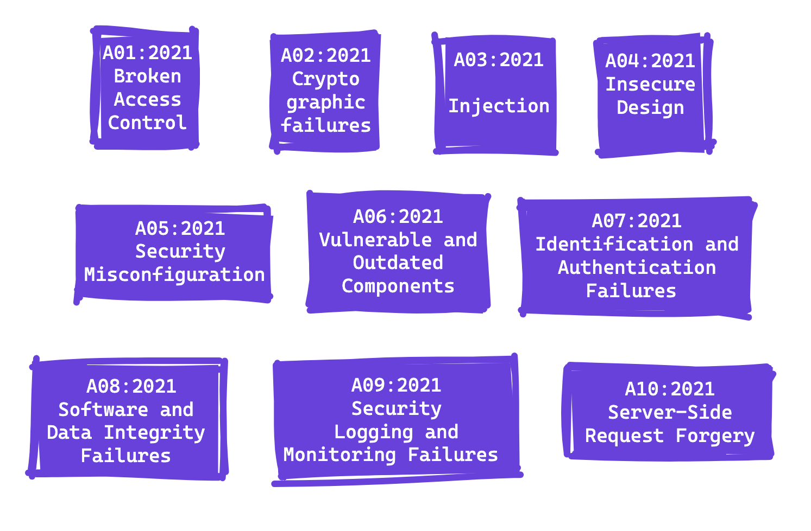

## What is a the OWASP top 10?

The OWASP Top 10 is a standard that developers and web security experts use to understand the most critical risks that web applications face. It's sort of like a cheat sheet for web security. It's really useful for making sure that your web application is secure and doesn't have any major vulnerabilities.



In this post, I'm going to dive into the OWASP Top 10 list and provide some code examples in JS to illustrate each risk. So if you're a web developer looking to improve your application's security, or just curious about the most critical risks facing web apps, keep reading!

## A01:2021-Broken Access Control

Think of your house's front door. The lock on your front door controls who can enter and exit your house. If the lock is working correctly, only those who have a key or know the combination can enter. This is similar to access control in web applications. Access control ensures that only authorized users can access certain parts of the application or perform certain actions.

Now, imagine if the lock on your front door was broken, and anyone could simply walk in without any restriction. This is similar to broken access control in web applications. If access control is not implemented correctly, attackers can gain access to sensitive data or functionality that they should not have access to.

So, just as it's important to have a properly functioning lock on your front door to protect your home, it's crucial to implement strong access control measures in web applications to protect user data and prevent unauthorized access.

Essentially, you should provide users with the minimum amount of permissions necessary to carry out their intended tasks, and no more.

Here's an example of a bad implementation of access control in an Express.js application:

```JS
  app.get('/admin', (req, res) => {
    if (req.user.role === 'admin') {
      res.render('admin-dashboard');
    } else {
      res.status(403).send('Access denied');
    }
  });
```

In this example, the server checks if the user role is 'admin' to grant access to the admin dashboard. However, this approach is flawed because anyone can access the admin dashboard by simply changing their user role to 'admin' in the browser's developer console or intercepting the request and modifying it.

Here's an example of a better implementation that includes proper access control:

```JS
app.get('/admin', checkAdminRole, (req, res) => {
  res.render('admin-dashboard');
});

function checkAdminRole(req, res, next) {
  if (req.user.role === 'admin') {
    next();
  } else {
    res.status(403).send('Access denied');
  }
}
```

In this example, a middleware function called checkAdminRole is used to check if the user role is 'admin' before granting access to the admin dashboard. This approach is more secure because the user cannot modify their role on the client-side, and the check is done on the server-side.

## A02:2021-Cryptographic failures

So, basically, when we talk about cryptographic failures, we're referring to any issues or weaknesses in the way that encryption and decryption processes are implemented in a web application. These processes are supposed to help protect sensitive information from unauthorized access by making it unreadable to anyone who doesn't have the appropriate decryption keys.

However, if the encryption and decryption processes are implemented incorrectly, or if weak or outdated cryptographic algorithms are used, then it becomes possible for attackers to exploit these weaknesses and gain access to sensitive information. This can lead to serious consequences such as data breaches, identity theft, and financial losses.

Some common examples of cryptographic failures include weak or easily guessable encryption keys, failure to properly authenticate or verify users' identities, and the use of outdated or insecure encryption algorithms.

To avoid these types of issues, it's important for developers to stay up-to-date on the latest best practices and standards for cryptography, and to carefully review and test all cryptographic implementations in their web applications. By doing so, we can help ensure that our applications are as secure as possible and that sensitive information is protected from unauthorized access.

## A03:2021-Injection

Injection attacks occur when an attacker is able to inject untrusted data into a web application, which can then be interpreted as code and executed by the application's back-end server.

The most common type of injection attack is SQL injection, which involves injecting SQL code into a form field or URL parameter. If the web application does not properly validate or sanitize this input, the attacker can execute arbitrary SQL commands on the back-end database, which can result in data theft or even complete loss of data.

Other types of injection attacks include LDAP injection, XML injection, and command injection, all of which can have similarly devastating effects if left unchecked.

To prevent injection attacks, it's important to validate and sanitize all user input, and to use prepared statements or parameterized queries when executing database or other back-end commands. This can help ensure that any injected data is treated as data rather than code, and cannot be executed by the application's back-end server.

## A04:2021-Insecure Design

Insecure Design refers to the architecture flaws that are introduced into an application due to poor design choices.

Avoiding architectural flaws is crucial in developing secure and reliable web applications because they can lead to vulnerabilities and weaknesses in the system's foundation, making it difficult to maintain security even with a well-implemented codebase.

The difference between Design and Implementation is critical to understand - a good implementation cannot fix a bad Design. No matter how well the code is written, if the architectural design is flawed, it can introduce security risks that are hard to rectify later in the development process and could lead to a Business risk.

To ensure a secure web application, follow these steps:

- Apply well-known reference pattern architecture, leveraging proven design patterns that align with security principles. I check on <a href="https://refactoring.guru/design-patterns/catalog" target="_blank">refactoring.guru</a> about patterns with code examples also in TypeScript.
- Thoroughly check the level of control offered by the Framework you are using, ensuring it aligns with your security requirements. <sup>Always read the documentation!</sup>
- Design using Privilege Separation, implementing role-based access control and limiting access to sensitive resources.

## A05:2021-Security Misconfiguration
