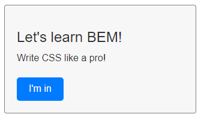

## But what exactly is it, and why should you use it?
If you're a web developer or designer learning CSS, you should know about BEM methodology. It's a popular approach for creating reusable and maintainable CSS code. 

BEM stands for Block, Element, Modifier. It's a naming convention that helps you organize and structure your CSS code. 

## Here's how it works:

1. A **Block** is a standalone component on your website. It can be anything from a navigation menu to a form or a header. You can think of it as a big container that encapsulates all of the related elements and modifiers.
2. An **Element** is a part of a block that has a specific function. For example, a navigation menu block might have elements like a logo, links, and a search bar.
3. A **Modifier** is a variation of a block or an element. It's used to change the appearance or behavior of a block or an element without duplicating the code. For example, a navigation menu block might have modifiers for its size or color scheme.

## So, why should you use BEM methodology in your web projects? 

Here are a few reasons:

- It helps you write more maintainable code. By using a consistent naming convention, you can easily understand and modify your CSS code without breaking anything.
- It makes your code more reusable. By breaking down your website into blocks and elements, you can reuse the same code across multiple pages or projects.
- It encourages better collaboration between developers and designers. By using a shared naming convention, everyone on your team can understand and work with the same code.

Of course, like any methodology, BEM has its limitations and drawbacks. For example, it can result in longer class names, which can be cumbersome to type and read. But overall, it's a useful tool for creating well-organized, reusable and maintainable CSS code.


## How can I start?

In this example, we have a block that we are going to call "block" that contains a title, text, and a button.

 

The BEM methodology is used to organize the CSS code by creating block-level selectors (.block) and element-level selectors (.block__title, .block__text, and .block__button). We can also create modifiers by adding a double dash (--) to the end of the class name (.block__button--primary, .block__button--secondary).

``` html 
<div class="block">
  <h2 class="block__title">Let's learn BEM!</h2>
  <p class="block__text">Write CSS like a pro!</p>
  <button class="block__button block__button--primary">I'm in</button>
</div>
```

By using the BEM methodology, we can keep our CSS code organized, maintainable, and reusable:

``` css 
.block {
  padding: 20px;
  background-color: #f7f7f7;
  border: 1px solid #666666;
  width: 320px;
  border-radius: 4px;
}

.block__title {
  font-size: 24px;
  margin-bottom: 10px;
}

.block__text {
  font-size: 16px;
  line-height: 1.5;
  margin-bottom: 20px;
}

.block__button {
  display: inline-block;
  padding: 10px 20px;
  border: none;
  border-radius: 5px;
  font-size: 16px;
  color: #fff;
  cursor: pointer;
}

.block__button--primary {
  background-color: #007bff;
}

.block__button--secondary {
  background-color: #6c757d;
}
```

<u><a class="link" href="https://codepen.io/alfioperino/pen/vYzgeNO" target="_blank">You can interact with the code in Codepen</a></u>
<!-- <a class="link" href="https://codepen.io/alfioperino/pen/vYzgeNO" target="_blank">You can interact with the code in Codepen</a> -->

